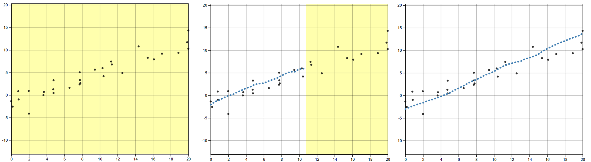

<!-- https://authorservices.wiley.com/author-resources/book-authors/prepare-your-manuscript/wiley-latex-template.html -->

# Introduction

Our visual system is naturally built to look for structure and identify patterns. For instance, points going down from left to right indicates a negative correlation between the $x$ and $y$ variables. How can we compare our intuitive visual sense of patterns to those determined by statistical methods?

## Testing Statistical Graphics

Graphical tests are useful for studying the perception of statistical graphs. Studies might ask participants to identify differences in graphs, read information off of a chart accurately, use data to make correct real-world decisions, or predict the next few observations. All of these types of tests require different levels of use and manipulation of the information being presented in the chart.

Efforts in the field of statistical graphics have developed graphical testing tools and methods. Through experimentation, graphical testing methods allow researchers to conduct studies geared at understanding human ability to conduct tasks related to the perception of statistical charts such as differentiation, prediction, estimation, and extrapolation. The advancement of graphing software provides the tools necessary to develop new methods of testing statistical graphics.

## Fitting Trends by Eye

Initial studies in the 20th century explored the use of fitting lines by eye through a set of points [@finney1951subjective; @mosteller1981eye]. Common methods of fitting trends by eye involved maneuvering a string, black thread, or ruler until the fit is suitable, then drawing the line through the set of points. Recently, @ciccione2021can conducted a comprehensive set of studies investigating human ability to detect trends in graphical representations from a psychophysical approach.

In 2015, the New York Times introduced an interactive feature, called 'You Draw It' [@aisch2015you], where readers input their own assumptions about various metrics and compare how these assumptions relate to reality. The New York Times team utilizes Data Driven Documents (D3) that allows readers to predict these metrics through the use of drawing a line on their computer screen with their mouse. 

## Research Objectives

The goal of this research is to implement ‘You Draw It’, adapted from the New York Times feature, as a way to measure the patterns we see in data. Here, we provide technical details of the software development, utilizing interactive graphics in R. We then share results from our study which validates 'You Draw It' as a method for graphical testing and apply an appropriate data analysis method to the participant data.

# Development

## 'You Draw It' Task

Users are shown an interactive scatter-plot \pcref{fig:you-draw-it-example} along with the prompt, "Use your mouse to fill in the trend in the yellow box region." The yellow box region moves along as the user draws their trend-line, providing a visual cue which indicates where the user still needs to complete a trend line. After the entire domain has been visually estimated or predicted, the yellow region disappears, indicating the participant has completed the task. Visit [bit.ly/3zHnlgp](https://bit.ly/3zHnlgp}) for a test applet.

## Source Code

Data Driven Documents (D3), a JavaScript-based graphing framework that facilitates user interaction, is used to create the 'You Draw It' visual. A challenge of working with D3 is the environment necessary to display the graphics and images. The `r2d3` package [@r2d3pkg] provides an efficient integration of D3 visuals into R HTML formats. We integrate the D3 visual source code into an R shiny [@shinypkg] application in order to allow for user interaction and data collection.

We conduct all data simulation and processing in R and output two data sets - *point data* and *line data* - containing ($x$, $y$) coordinates corresponding to either a simulated point or fitted value predicted by a statistical model respectively. Then, the `r2d3` package converts the data sets in R to JSON to be interpreted by the D3.js code. We define functions in D3.js to draw the initial plot and set up drawable points for the user drawn line. Drag events in D3.js are utilized to react to observe and react to user input. Shiny Messages are used to communicate the user interaction between the D3 code and the R environment. The plot is then rendered and updated on user interaction into the R shiny application with the `RenderD3` and `d3Output` functions. 

Parameters for aesthetic design choices are defined in a list of options and `r2d3` passes these to the D3.js code. For instance, we can specify the buffer space allowed for the $x$ and $y$ axes to avoid users to anchor their lines to the axes limits. 

For `D3.js` source code, visit [bit.ly/3teA3lM](https://bit.ly/3teA3lM).

```{r, you-draw-it-example, echo = F, out.width = "100%", fig.align='center', fig.cap = "'You Draw It' interaction task plot as shown to user. \\textbf{Left:} illustrates what user first sees with the prompt \\textit{`Use your mouse to fill in the trend in the yellow box region.'} \\textbf{Middle:} illustrates what the user sees while completing the task. \\textbf{Right:} illustrates the users finished trend line."}

```

# Application

## Tool Validation

We conducted a study in order to validate 'You Draw It' as a method for graphical testing, comparing results to the less technological method utilized in @mosteller1981eye. Results from our study were consistent with those found in the previous study; when shown points following a linear trend, participants tended to fit the slope of the first principal component over the slope of the least-squares regression line. This trend was most prominent when shown data simulated with larger variances. This study reinforces the differences between intuitive visual model fitting and statistical model fitting, providing information about human perception as it relates to the use of statistical graphics.

## Data Analysis

Feedback data from conducted studies are collected and stored in a database for analysis. Within the collected feedback data, we know the simulated data points, the predicted values from the statistical model, and the predicted values from the user drawn line. In our initial studies, a unique data set was simulated independently for each participant. Therefore, we evaluate the accuracy of the user drawn line by observing the deviation, vertical residuals, between the user drawn line and the predicted values from the statistical model. We use a Generalized Additive Mixed Model (GAMM) to model the vertical residuals in order to statistically compare visually fitted trends to actual metrics, simulated data models, or statistical regression results. A benefit of using a GAMM is the estimation of smoothing splines, allowing for flexibility in the residual trend.

# Future Work

In this work, we implemented and validated ‘You Draw It’ as a way to measure the patterns we see in data. We demonstrated the use of generalized additive models to statistically model participant data. While technical details of the development process are presented here, we intend to create an R package designed for easy implementation of 'You Draw It' task plots in order to make this tool accessible to other researchers. Further investigation is necessary to implement this method real data in order to facilitate scientific communication.